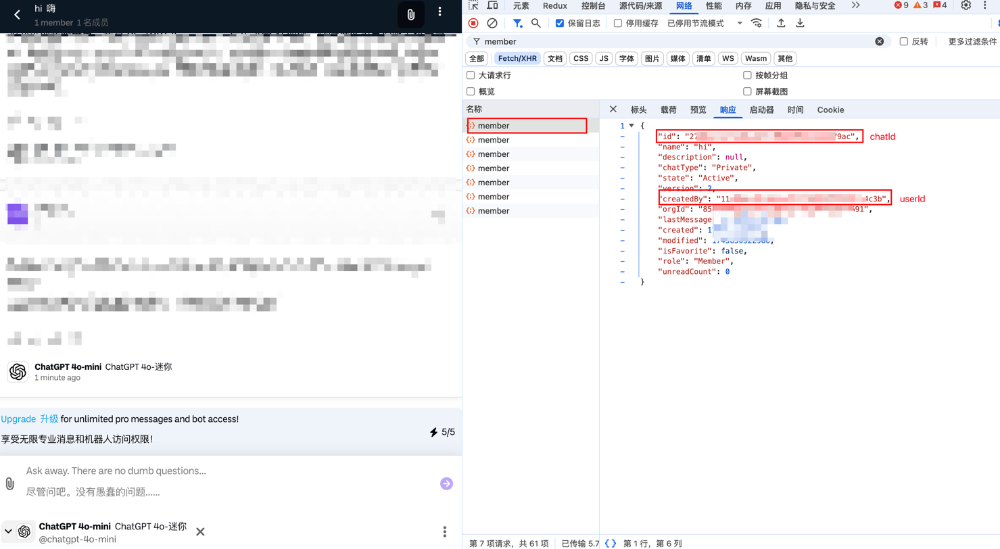
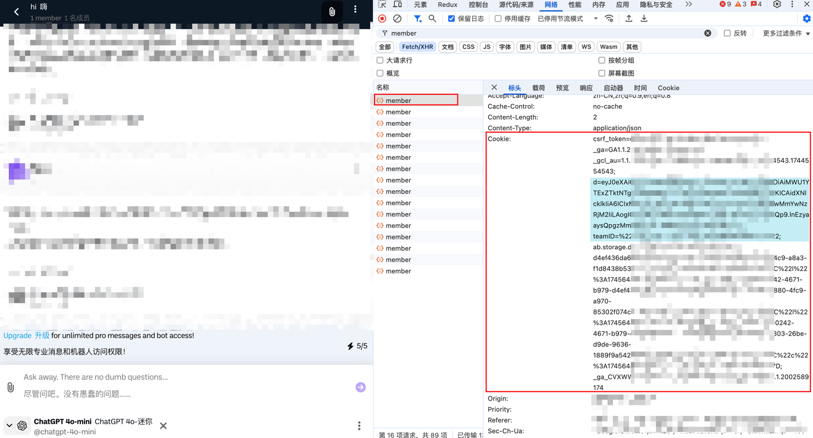

<p align="right">
   <strong>中文</strong> 
</p>
<div align="center">

# boodlebox2api

_觉得有点意思的话 别忘了点个 ⭐_

<a href="https://t.me/+LGKwlC_xa-E5ZDk9">
    
    <span style="text-decoration: none; font-size: 12px; color: #0088cc; vertical-align: middle;">Telegram 交流群</span>
</a>

<sup><i>(原`coze-discord-proxy`交流群, 此项目仍可进此群**交流** / **反馈bug**)</i></sup>
<sup><i>(群内提供公益API、AI机器人)</i></sup>

</div>

## 功能

- [x] 支持文生图接口(`/images/generations`),详情查看[支持模型](#支持模型)
- [x] 支持自定义请求头校验值(Authorization)
- [x] 可配置代理请求(环境变量`PROXY_URL`)

### 接口文档:

略

### 示例:

略

## 如何使用

略

## 如何集成NextChat

略

## 如何集成one-api

略

## 部署

[点击查看部分环境变量获取方式](#环境变量获取方式)

### 基于 Docker-Compose(All In One) 进行部署

```shell
docker-compose pull && docker-compose up -d
```

#### docker-compose.yml

```docker
version: '3.4'

services:
  boodlebox2api:
    image: deanxv/boodlebox2api:latest
    container_name: boodlebox2api
    restart: always
    ports:
      - "10066:10066"
    volumes:
      - ./data:/app/boodlebox2api/data
    environment:
      - BB_COOKIE=******  # cookie 
      - USER_ID=******  # 用户ID
      - API_SECRET=123456  # [可选]接口密钥-修改此行为请求头校验的值(多个请以,分隔)
      - TZ=Asia/Shanghai
```

### 基于 Docker 进行部署

```docker
docker run --name boodlebox2api -d --restart always \
-p 10066:10066 \
-v $(pwd)/data:/app/boodlebox2api/data \
-e BB_COOKIE=***** \
-e USER_ID=***** \
-e API_SECRET="123456" \
-e TZ=Asia/Shanghai \
deanxv/boodlebox2api
```

其中`API_SECRET`、`BB_COOKIE`、`USER_ID`修改为自己的。

如果上面的镜像无法拉取,可以尝试使用 GitHub 的 Docker 镜像,将上面的`deanxv/boodlebox2api`替换为
`ghcr.io/deanxv/boodlebox2api`即可。

### 部署到第三方平台

<details>
<summary><strong>部署到 Zeabur</strong></summary>
<div>

[](https://zeabur.com?referralCode=deanxv&utm_source=deanxv)

> Zeabur 的服务器在国外,自动解决了网络的问题,~~同时免费的额度也足够个人使用~~

1. 首先 **fork** 一份代码。
2. 进入 [Zeabur](https://zeabur.com?referralCode=deanxv),使用github登录,进入控制台。
3. 在 Service -> Add Service,选择 Git（第一次使用需要先授权）,选择你 fork 的仓库。
4. Deploy 会自动开始,先取消。
5. 添加环境变量

   `BB_COOKIE=******`  cookie 

   `USER_ID=******`  用户id 

   `API_SECRET=123456` [可选]接口密钥-修改此行为请求头校验的值(多个请以,分隔)(与openai-API-KEY用法一致)

保存。

6. 选择 Redeploy。

</div>


</details>

<details>
<summary><strong>部署到 Render</strong></summary>
<div>

> Render 提供免费额度,绑卡后可以进一步提升额度

Render 可以直接部署 docker 镜像,不需要 fork 仓库：[Render](https://dashboard.render.com)

</div>
</details>

## 配置

### 环境变量

1. `PORT=10066`  [可选]端口,默认为10066
2. `DEBUG=true`  [可选]DEBUG模式,可打印更多信息[true:打开、false:关闭]
3. `API_SECRET=123456`  [可选]接口密钥-修改此行为请求头(Authorization)校验的值(同API-KEY)(多个请以,分隔)
4. `BB_COOKIE=******`  cookie 
5. `USER_ID=******`  用户id 
6. `IMAGE_CHAT_ID=******`  [可选]生图默认对话id,默认为空
7. `REQUEST_RATE_LIMIT=60`  [可选]每分钟下的单ip请求速率限制,默认:60次/min
8. `PROXY_URL=http://127.0.0.1:10801`  [可选]代理
9. `ROUTE_PREFIX=hf`  [可选]路由前缀,默认为空,添加该变量后的接口示例:`/hf/v1/chat/completions`

### 环境变量获取方式

1. 打开[boodle](https://box.boodle.ai/launch/chat)。
2. 打开**F12**开发者工具。
3. 发起对话。
4. `member`接口中`id`即是对话id,可将其配置为环境变量`IMAGE_CHAT_ID`,
   `createdBy`即是用户id,配置为环境变量`USER_ID`
  
5. `member`接口中`header`中的`Cookie`即环境变量`BB_COOKIE`的值(较为关键的是图中蓝色高亮的内容)。
  

## 进阶配置

略

## 支持模型

> 新用户走[AFF](https://boodle.cello.so/8li1JggXfUg)可首次可免费开通PRO订阅。

| 模型名称(生图)             | 
|----------------------|
| dall-e-3             |
| flux-pro             |
| ideogram-v2          |
| stable-diffusion-3.5 |
| stable-diffusion-xl  |

## 报错排查

略

## 其他

> 新用户通过[boodleAI](https://boodle.cello.so/8li1JggXfUg)注册可首次可**免费**开通PRO订阅。
